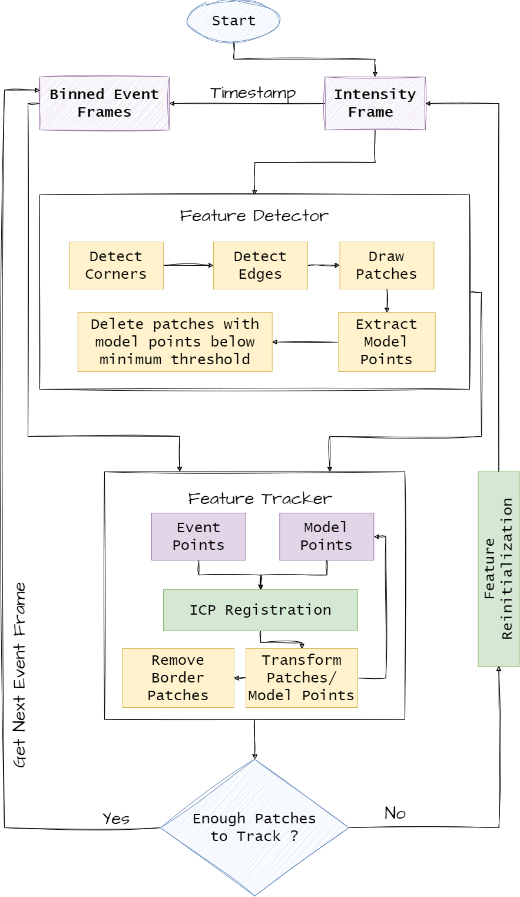

This is Hands-on Perception Course Project on Event-Based Feature Tracking Using the Iterative Closest Point (ICP) Algorithm. The main workflow for this project is illustrated in the figure below:

